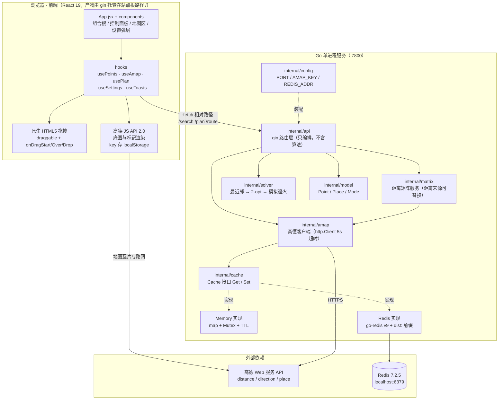
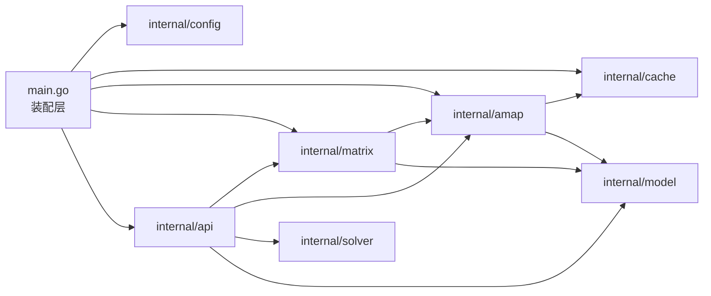
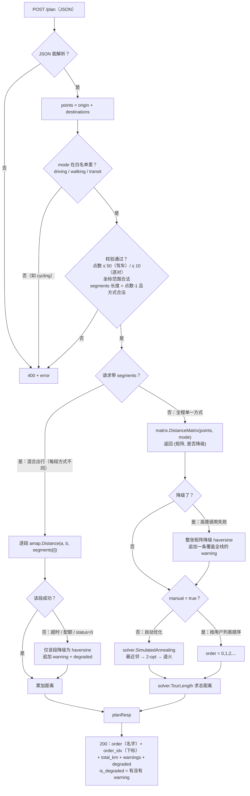
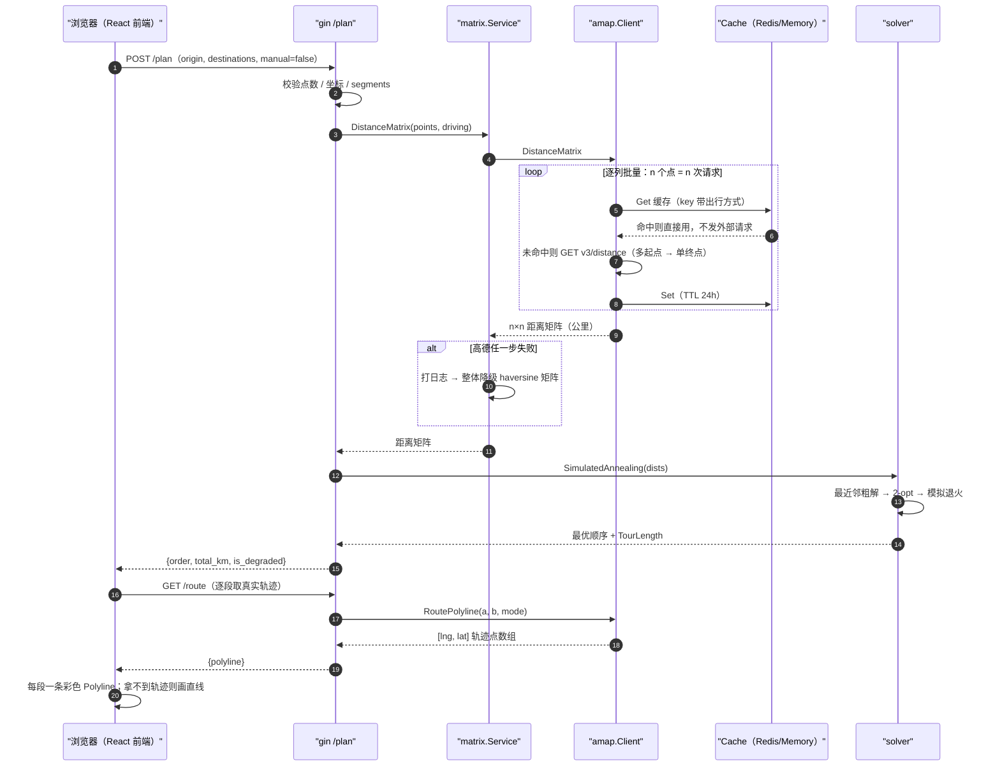
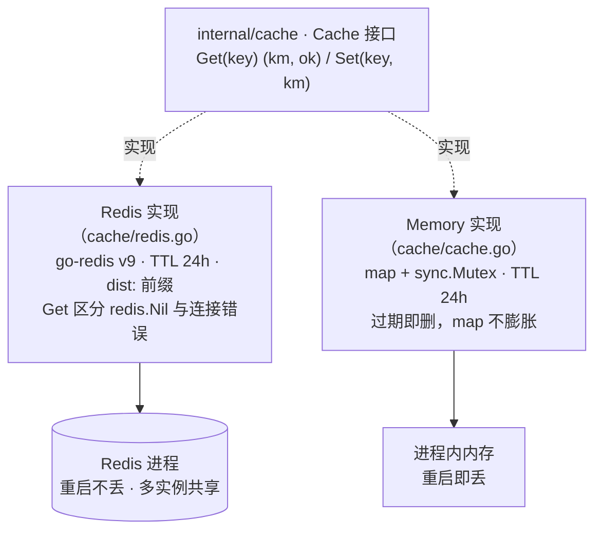
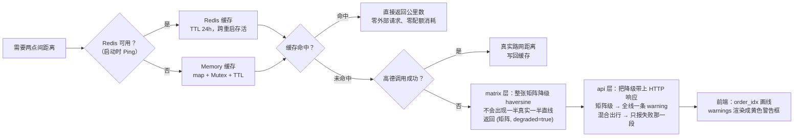

# 路线规划项目架构图（Mermaid 版）

> **本文档说明**
> - 原版为 ASCII 手绘图，2026-08-28 改写为 **Mermaid**：图即文本，改代码时直接改这里，GitHub / VS Code / GoLand / Typora 都能渲染。
> - 同时修正了过时信息：`internal/model/point.go` → **`internal/model/model.go`**；技术栈区分「**已实现**」与「**规划中**」。
> - **2026-09-14 更新**：补上 `mode` 白名单校验（§5、§8.3）、降级上报链路（§5、§7.3、§7.4、§8.4）、
>   点数上限分档（§8.3）、`order_idx`（§5、§10）、高德路径常量表（§9）；并修正设计文档与实现的偏差。
> - 全项目的教学路线见 `AGENTS.md`，设计原文见 `docs/superpowers/specs/2026-08-13-route-planner-design.md`。

---

## 一、技术栈

### 1.1 已实现（Phase 0 + Phase 1）

| 层 | 技术 | 版本 | 在项目里干什么 |
|---|---|---|---|
| 语言 | **Go** | 1.26 | 后端全部逻辑 |
| HTTP 框架 | **gin** | v1.12.0 | 路由、JSON 绑定、日志 + panic 恢复中间件 |
| 缓存客户端 | **go-redis** | v9.22.0 | 实现 `cache.Cache`，构造时 `Ping` 探活 |
| 缓存服务 | **Redis** | 7.2.5（`.redis-src/` 源码编译） | 距离缓存，TTL 24h，重启不丢 |
| 算法 | **手写 TSP** | — | 最近邻 → 2-opt → 模拟退火（标准库 `math/rand`、`slices`） |
| 距离兜底 | **haversine** | — | 球面直线距离，高德失败时降级用（标准库 `math`） |
| 外部 API | **高德 Web 服务** | v3 / v5 | `v3/distance`、`v3/direction/driving`、`v3/direction/walking`、`v3/direction/transit/integrated`、`v5/direction/walking`、`v3/place/text`；用标准库 `net/http` 直调，**无 SDK** |
| 前端 | **React 19 + Vite 8** | — | 组件化 + hooks；`fetch` 调自家后端（源码 `frontend/`，产物 `web/`） |
| 前端地图 | **高德 JS API** | 2.0 | 底图、标记、折线；key + 安全密钥存浏览器 `localStorage`（缺安全密钥时地图能渲染，但搜索/算距离类能力报 `INVALID_USER_SCODE`） |
| 前端拖拽 | **原生 HTML5 DnD** | — | 零依赖：`draggable` + `onDragStart/Over/Drop`（不再引 SortableJS） |
| 测试 | **标准库 `httptest`** | — | `amap_test.go` 抓高德响应、`api/router_test.go` 验边界校验与降级上报、`tsp_test.go` 验算法 |
| 工具链 | GoLand、git、`go vet`、`node --check` | — | 沙箱内 Go 命令需带 `GOPATH/GOCACHE/GOMODCACHE` |

### 1.2 规划中（Phase 2 / Phase 3）

| 阶段 | 技术 | 用途 | 状态 |
|---|---|---|---|
| Phase 2 | **Redis Stream**（消费组） | 规划任务异步化：提交即返回，后台算 | 未开始（Redis 环境已就绪） |
| Phase 2 | **MySQL 8.4** + **`database/sql`** | 持久化历史路线；不引 ORM | 未开始（本机已有 `mysql:8.4` 镜像） |
| Phase 2 | **Repository 模式** | 把 SQL 关在存储层后面，业务不碰 SQL | 未开始 |
| Phase 3 | **gRPC + Protobuf** | 拆 `api` / `matrix` / `solver` 三个服务 | 未开始 |

---

## 二、项目目录结构

```
awesomeProject/
│
├── main.go                         # 装配层：读配置 → 拼包 → 启动（不写业务逻辑）
├── go.mod / go.sum                 # module awesomeProject，go 1.26
├── README.md / LICENSE / AGENTS.md # 说明、协议、跨会话项目记忆
│
├── internal/                       # Go 强制封装：外部模块无法 import
│   ├── config/config.go            # 环境变量 → Config（PORT/AMAP_KEY/REDIS_ADDR）
│   ├── model/model.go              # Point / Place / Mode
│   ├── cache/
│   │   ├── cache.go                # Cache 接口 + Memory 实现（map + Mutex + TTL）
│   │   └── redis.go                # Redis 实现（go-redis + dist: 前缀）
│   ├── amap/amap.go                # 高德客户端：矩阵 / 单对距离 / 轨迹 / 搜索
│   ├── matrix/matrix.go            # 距离矩阵服务：高德 → haversine 降级
│   ├── solver/tsp.go               # 最近邻 → 2-opt → 模拟退火 + TourLength
│   └── api/router.go               # gin 路由 + 参数校验 + /plan 编排
│
├── frontend/                       # 前端源码（React 19 + Vite）
│   └── src/
│       ├── App.jsx                 # 组合根：持有跨子树状态 + 摆版面
│       ├── api.js                  # 后端接口唯一出口（fetch 封装 + 错误归一化）
│       ├── theme.js                # 设计变量的 JS 侧（地图折线读不到 CSS 变量）
│       ├── components/             # TopBar / ControlPanel / MapView / PointList …
│       ├── hooks/                  # usePoints · useAmap · usePlan · useSettings · useToasts
│       └── styles/                 # tokens.css（设计变量）+ app.css
│
├── web/                            # 前端构建产物（.gitignore；gin NoRoute 托管在**站点根路径**）
│   ├── index.html
│   └── assets/                     # index-*.js + index-*.css（由 npm run build 生成）
│
├── docs/
│   ├── architecture-diagrams.md    # ← 本文档
│   └── superpowers/specs/2026-08-13-route-planner-design.md
│
└── （本地环境，.gitignore 忽略）
    ├── .gopath/ .gocache/ .gomodcache/   # 沙箱内 Go 工具链缓存
    └── .redis-src/redis-7.2.5/           # 源码编译的 Redis
```

---

## 三、系统架构图



**要点**：`/search` 与 `/route` 是**代理接口**——前端不持有高德 Web 服务 key，第三方凭据只存在于后端进程的环境变量里。

---

## 四、包依赖关系图



**依赖规则（为什么这么切）**

| 规则 | 原因 |
|---|---|
| 依赖方向**单向**，无环 | 环会让包无法单独测试、无法单独演进成微服务 |
| `solver` 只吃 `[][]float64`，**不认识 amap** | 算法不该关心距离从哪来；将来换 gRPC 距离服务，solver 零改动 |
| `api` 不直接算距离/排序 | 编排层只做参数校验与串联，业务在各自包里 |
| `amap` 依赖 `Cache` **接口**，不认识 Redis | 依赖倒置：换缓存实现，`amap` 零改动 |
| `matrix` 是 `amap` 与 `solver` 之间的**中间层** | 降级策略集中在一处，调用方无感知 |

---

## 五、`POST /plan` 数据流



**两条业务约束，不是实现偷懒**：

1. **混合出行不做 TSP**：TSP 需要一张**统一口径**的距离矩阵才能比较"哪条顺序更短"。
   每段出行方式不同时，段与段之间的距离不可比，全局最优顺序无从谈起——所以混合出行固定按用户列表顺序逐段计算。
2. **`order` 和 `order_idx` 都要返回**：名字不是标识符。用户搜两次"故宫"就会有两个同名点，
   拿名字回查坐标只能查到一个，线就画错了。**名字负责给人看，下标负责给机器用。**

**两处降级的可见性也不同**（都在响应里，不是只写日志）：

| 降级粒度 | 追加到 `warnings` | 追加到 `degraded` |
|---|---|---|
| 整张矩阵（单一方式走 TSP） | 一条覆盖全线的警告 | 不追加（没有"哪一段"可言） |
| 混合出行某一段 | 该段一条警告 | 该段名，如 `天安门→故宫` |

`is_degraded` 统一取 `len(warnings) > 0`——**单一真相源**。以前它判断的是 `degraded` 列表，
而矩阵整体降级时那个列表是空的，于是 `is_degraded=false`：用户拿到一个看起来毫无异常的
公里数，却不知道那只是直线估算。这是最坏的失败方式——错得悄无声息。

---

## 六、一次自动规划的时间线



---

## 七、缓存与降级机制

### 7.1 `Cache` 接口与两种实现



### 7.2 缓存 key 设计

```go
// internal/amap/amap.go
func cacheKey(mode model.Mode, a, b model.Point) string {
    return string(mode) + "|" + coord(a) + "->" + coord(b)
}
```

示例（经度在前，与高德格式一致）：

```
driving|113.324500,23.106600->113.326500,23.108600
walking|113.324500,23.106600->113.326500,23.108600
transit|113.324500,23.106600->113.326500,23.108600
```

Redis 里再加一层 `dist:` 前缀，`redis-cli KEYS 'dist:*'` 一眼看清所有距离缓存。

**为什么 key 要带出行方式**：同一个点对，驾车和步行的距离不同。共用 key 会互相污染——这是"缓存粒度必须匹配业务语义"的典型例子。

### 7.3 三层降级



### 7.4 降级决策表

| 故障点 | 典型原因 | 降级策略 | 日志前缀 |
|---|---|---|---|
| Redis 连接 | 进程没起 / 网络不通 | → 进程内 Memory 缓存（**不算降级**，距离来源没变，不给用户报警告） | `redis unavailable` |
| 高德 API（矩阵） | 配额超限 / 超时 / `status=0` | → 整张矩阵 haversine 直线，**并回传 `is_degraded=true` + 全线一条 warning** | `[matrix] amap ... falling back` |
| 高德 API（混合出行某段） | 单段失败 | → 仅该段 haversine，其余段继续；该段名进 `degraded` | `[plan] 路段 ... 失败` |
| 非法 `mode` | 调用方拼错（如 `cycling`） | → **400 直接拒绝**，不做降级（参数错 ≠ 外部依赖故障） | — |
| `/route` 轨迹 | 公交无连续轨迹 | → 返回空数组，前端该段画直线（业务事实，非错误） | `console.warn` |
| `/route` 非法 mode | 调用方拼错 | → **400 拒绝**（以前会静默返回空数组） | — |
| Redis 读写报错 | 连接断开 / 磁盘满 | 记日志后当作未命中，继续走高德 | `[redis] get/set key=... failed` |

### 7.5 缓存命中效果（历史实测）

场景：广州塔 → 白云山 → 长隆（3 个点，驾车）

| 请求 | 高德请求次数 | 耗时 | 说明 |
|---|---|---|---|
| 首次 | 3 次（逐列批量） | ~0.33 s | 写入 6 个 key（3 点 × 2 方向） |
| 二次（同路线） | **0 次** | ~0.06 s | 全部命中，加速比 ≈ 5.5× |
| 重启 Go 服务后 | **0 次** | ~0.06 s | Redis 进程还在，缓存跨进程存活 |

---

## 八、架构设计原则

### 1. 依赖倒置（DIP）

高层模块和低层模块都依赖抽象。

```go
// 定义抽象（cache/cache.go）
type Cache interface {
    Get(key string) (km float64, ok bool)
    Set(key string, km float64)
}

// 高层依赖抽象（amap/amap.go）——它不知道 Redis 的存在
type Client struct {
    cache cache.Cache
}
```

收益：`amap` 零改动即可在 Redis / Memory 之间切换；将来换缓存后端（如本地文件、Memcached）也不用碰 `amap`。

### 2. 单一职责（SRP）

| 包 | 唯一职责 |
|---|---|
| `api` | HTTP 接口：绑定、校验、编排 |
| `matrix` | 距离矩阵：决定距离从哪来、失败怎么退 |
| `solver` | TSP 算法：只吃距离矩阵 |
| `amap` | 高德 API：外部调用、解析、缓存、节流 |
| `cache` | 缓存抽象：存取，不掺和业务 key 语义 |

### 3. 防御性编程

外部输入一律不可信，而且**校验必须收口在边界（`api` 层）**：

| 输入 | 规则 | 为什么 |
|---|---|---|
| `mode` | 白名单 `driving/walking/transit`，非法 → 400 | 漏了它，`cycling` 会被一路带到 amap 报错、再被 matrix 吞掉降级，最后返回 200 |
| 点数 | 驾车 ≤ `MaxPoints`(50)；步行/公交/混合 ≤ `MaxPointsPairwise`(10) | **限制要按最坏路径算**：逐对接口下 50 点 = 2450 次请求 ≈ 14 分钟 |
| 坐标 | `lat ∈ [-90,90]`、`lng ∈ [-180,180]` | 越界坐标会算出荒唐距离，宁可 400 |
| `segments` | 长度必须 = 点数 −1，每项走同一套 mode 白名单 | 长度不符会让"第 i 段"错位，静默算错 |
| 高德响应 | 解析前先查 `len(paths) == 0`；结果条数必须等于请求条数 | 避免越界 panic，也避免"契约被破坏还照用" |

**同一个参数在两个接口必须一套标准**：`/plan` 和 `/route` 都调同一个 `parseMode()`。
以前 `/route` 没校验，`mode=cycling` 走到 `RoutePolyline` 的 `default` 分支返回 `(nil, nil)`，
于是 200 + 空数组——把"参数拼错了"伪装成"正常返回空"。

### 4. Fail Open（容错降级）

缓存挂了服务照跑（只是慢），高德挂了至少有直线距离，混合出行一段失败不影响其他段。

**但"降级必须可见"要做到两件事，缺一不可**：

1. **打日志**——给运维看
2. **回传响应**——给用户看。日志在服务器上，用户看不到

所以 `matrix.DistanceMatrix()` 的签名是 `([][]float64, bool)`：第二个返回值专门用来
把"这张矩阵是降级来的"这件事**带出包外**。只写日志是不够的——这是本项目踩过的坑：

```go
// internal/api/router.go
dists, degradedByMatrix := s.matrix.DistanceMatrix(points, mode)
if degradedByMatrix {
    warnings = append(warnings, "高德路网距离获取失败,本次总距离为直线估算,仅供参考")
}
// …
IsDegraded: len(warnings) > 0,  // 单一真相源:有 warning 就是有估算值
```

**另一个容易混的点：「设计如此」不等于「降级」**。没配 `AMAP_KEY` 时走 haversine，
那是本来就这么设计，不该给用户报警告；配了 key 但调用失败才算降级。
两者的告警价值天差地别——把"设计如此"也报成警告，真正的故障就会被噪音淹掉。

```go
// internal/api/router.go —— 混合出行的"部分失败容错"
km, err := s.amap.Distance(points[i], points[i+1], model.Mode(req.Segments[i]))
if err != nil {
    segmentName := points[i].Name + "→" + points[i+1].Name
    log.Printf("[plan] 路段 %s 失败(%v), 降级到直线距离", segmentName, err)

    km = matrix.Haversine(points[i], points[i+1]) // 复用 matrix 的公式,不再复制一份
    warnings = append(warnings, "路段 "+segmentName+" 的高德路线获取失败，已降级为直线距离")
    degraded = append(degraded, segmentName)
}
```

> 顺带一个教训：这段代码以前自己复制了一份 haversine 实现，注释还写着
> "避免循环依赖（api 不能调 matrix 的内部实现）"——可 `api` 本来就 import 了 `matrix`，
> 根本不存在环。**同一个公式两份代码 = 两个真相源**，哪天改地球半径或换算法，
> 总有一处会被忘掉。所以 `matrix.Haversine(a, b)` 导出给上层复用。

### 5. 日志可观测性

统一格式 `[模块] 动作 key=... failed: err`：

```
[amap] driving 2 origins -> 113.324500,23.106600
[matrix] amap driving failed (...), falling back to haversine
[redis] get key=driving|... failed: connection refused
[plan] 路段 广州塔→白云山 失败(...), 降级到直线距离
```

外部调用**必须设超时**（`http.Client{Timeout: 5 * time.Second}`）——一个慢请求不该拖死整个 `/plan`。

### 6. 接口设计：契约先行

先定 JSON 契约再写实现，前后端才能并行。`/plan` 的契约：

```json
// 请求
{ "origin": {"name":"广州塔","lat":23.1066,"lng":113.3245},
  "destinations": [{"name":"白云山","lat":23.1794,"lng":113.2956}],
  "manual": true,
  "segments": ["walking"] }

// 响应
{ "order": ["广州塔","白云山"], "total_km": 12.3,
  "warnings": [], "degraded": [], "is_degraded": false }
```

### 7. 前后端分离

同源部署（gin `NoRoute` 托管 `web/`）→ 不需要 CORS；前端只认相对路径，不需要知道端口。`NoRoute` 而非 `Static("/")`：httprouter 不允许根 catch-all 与 `/healthz` 这类具体路由共存（会 panic）。

---

## 九、设计模式应用

| 模式 | 在项目里的落点 |
|---|---|
| **依赖注入** | `main.go` 装配所有依赖并注入，其他包不自己 `new` 外部资源 |
| **适配器** | ①`Cache` 接口适配 Redis / Memory 两种实现；②高德 REST 根地址是 `Client` 的**实例字段**（`NewClientWithBase`），测试据此把请求指向本地假服务器 |
| **策略** | 出行方式 = 不同高德接口与路径（见下面的路径表） |
| **模板方法** | TSP 固定流程：最近邻粗解 → 2-opt → 模拟退火 |
| **代理** | `/search`、`/route` 代理高德，第三方 key 不进前端 |

高德接口路径全部常量收口在 `internal/amap/amap.go`，一眼看清项目依赖了哪些接口：

| 常量 | 路径 | 用途 | 备注 |
|---|---|---|---|
| `pathDistance` | `/v3/distance` | 驾车距离矩阵 | 批量：多个起点 → 单个终点 |
| `pathDrivingDir` | `/v3/direction/driving` | 驾车单段距离 / 轨迹 | 含 `steps[].polyline` |
| `pathWalkingV5` | `/v5/direction/walking` | 步行单段距离 | 数值准，但**不返回轨迹** |
| `pathWalkingV3` | `/v3/direction/walking` | 步行轨迹 | 画线用它，因为只有它有轨迹 |
| `pathTransitDir` | `/v3/direction/transit/integrated` | 公交单段距离 | 轨迹不连续，不出 polyline |
| `pathPlaceText` | `/v3/place/text` | 关键词搜地点 | `/search` 用它 |

> **同一个出行方式两个路径**不是笔误：步行距离用 v5（数据准），步行轨迹只能用 v3
> （v5 不返回坐标）。这类"文档看不出来、实测才知道"的细节，正是 `scripts/smoke.sh`
> 存在的理由——`httptest` 抓不到真实 API 的行为。

---

## 十、API 速查

| 接口 | 参数 | 说明 |
|---|---|---|
| `GET /healthz` | — | 健康检查，返回 `ok` |
| `POST /plan` | JSON body：`origin`、`destinations[]`、`mode`、`manual`、`segments[]` | 规划路线；`segments` 非空即混合出行 |
| `GET /search` | `q`（必填）、`city`（可空=全国） | 地名搜索代理，返回 `{places:[{name,address,lat,lng}]}` |
| `GET /route` | `origin=lng,lat`、`dest=lng,lat`、`mode` | 单段真实路网轨迹，返回 `{polyline:[[lng,lat],...]}` |
| 其他任意路径 | — | 由 `web/` 静态文件兜底（`NoRoute`） |

**`/plan` 响应字段**

| 字段 | 说明 |
|---|---|
| `order` | 访问顺序，**名字**数组（给人看） |
| `order_idx` | 访问顺序，**下标**数组，指向 `[origin] + destinations`（给机器用，前端按它画线） |
| `total_km` | 沿该顺序走完全程的总距离 |
| `warnings` | 人类可读的降级说明 |
| `degraded` | 降级的具体路段名（混合出行才有） |
| `is_degraded` | = `len(warnings) > 0`，单一真相源 |

**错误码约定**

| 情况 | 返回 |
|---|---|
| `mode` / 坐标 / `segments` 非法，或点数超上限 | **400**（参数错，别猜，直接拒绝） |
| 未配置 `AMAP_KEY` 时的 `/search`、`/route`、混合出行 | **503** |
| 高德业务失败（配额/超时/`status=0`）且无法降级 | **502** |
| 高德失败但可降级（`/plan`） | **200** + `is_degraded=true` |

---

## 十一、总结与后续

**已覆盖的教学点**

- Go 基础：接口、结构体、多返回值错误处理、`sync.Mutex`、包与 `internal` 封装
- Web：gin 路由、中间件、静态托管、JSON 绑定、参数校验
- 外部集成：REST 调用、超时、缓存、TTL、节流（QPS 保护）、代理模式
- 算法：最近邻、2-opt、模拟退火，以及"为什么 TSP 在混合出行下失效"
- 架构：依赖倒置、单一职责、容错降级、可观测性、契约先行

**后续阶段**

- **Phase 2**：Redis Stream 消费组（规划任务异步化）+ MySQL 持久化（`database/sql`，不引 ORM）+ Repository 模式
- **Phase 3**：按现有包边界拆 `api` / `matrix` / `solver` 三个 gRPC 服务（当前 `internal/` 的切分就是为了这一步）
