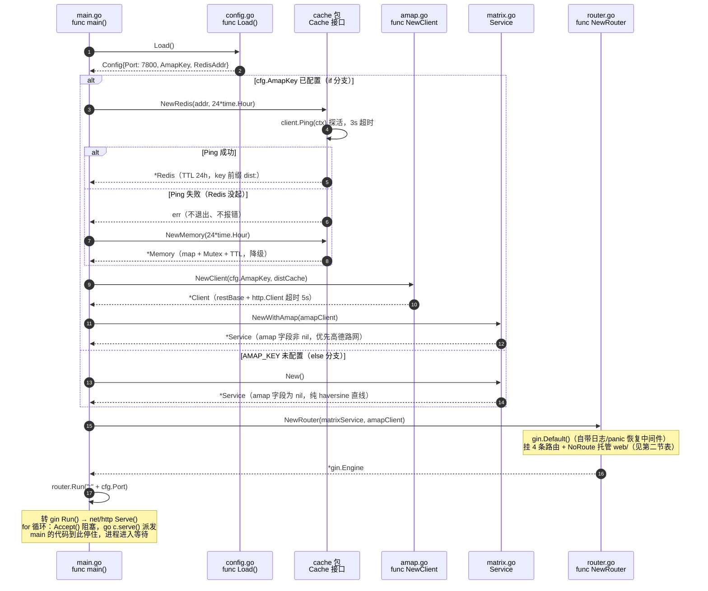
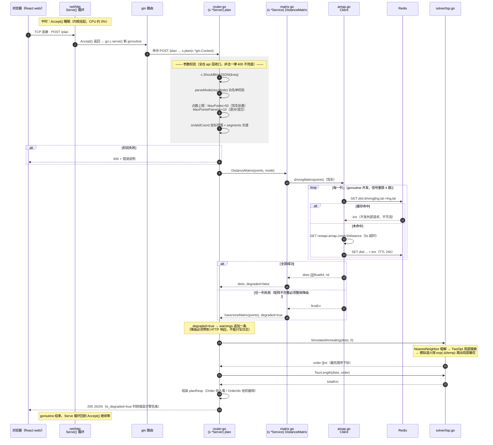
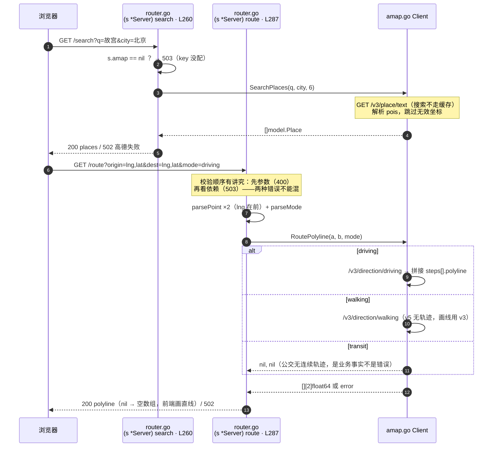

# 服务启动与请求流转（Mermaid 时序图）

> **本文档回答两个问题**：① 服务是怎么启动的？② 一次路径分析请求是怎么流转的？
> 静态分层架构（谁依赖谁）见 `architecture-diagrams.md`；本文画的是**运行时生命周期**。
> 2026-09-16 由 flowchart 版改写为**时序图**，函数名、签名、行号以当日代码为准
> （行号会随后续改动漂移，函数名不会）。

---

## 〇、一句话速查

| 问题 | 答案 |
|---|---|
| 入口文件 | `main.go` |
| 入口函数 | `func main()`（package main 的唯一入口，**启动时只执行一次**） |
| 监听地址 | `cfg.Port`（默认 `7800`），由 `router.Run(":" + cfg.Port)` 发起 |
| main 的终点 | 阻塞在 `router.Run(...)` 这一行——等待循环在标准库 `net/http.Serve()` 的 `for { Accept(); go c.serve() }` 里（第六节） |

---

## 一、启动时序

`main` 是**装配层**：把各包的组件 new 出来、接上线，然后交给 HTTP 框架。注意缓存只在**有 key**时才装配——没 key 时矩阵直接走 haversine，根本用不到缓存。



要点：

- **Redis 连不上不报错、不退出**——打一行 `redis unavailable` 日志后降级进程内 map，任何一个外部依赖挂掉服务照常跑
- 装配出的 `matrixService` / `amapClient` 是**全项目唯一实例**（构造函数返回指针），之后所有请求共享
- 启动日志可核对：`redis cache enabled at ...`（或 `redis unavailable`）、`amap enabled`、`listening on :端口`

## 二、启动后注册的 HTTP 接口（详细）

| 方法 | 路径 | handler 函数 | 位置 | 入参 | 出参 | 错误 |
|---|---|---|---|---|---|---|
| GET | `/healthz` | `NewRouter` 里的**匿名函数** | L84 | 无 | `200` 文本 `ok` | 无 |
| POST | `/plan` | `func (s *Server) plan(c *gin.Context)` | L131 | 见下 | 见下 | 400 / 503 |
| GET | `/search` | `func (s *Server) search` | L260 | `?q=` 必填、`?city=` 可选 | `{"places": [{name, address, lat, lng}]}` | 400 缺 q · 503 无 key · 502 高德失败 |
| GET | `/route` | `func (s *Server) route` | L287 | `?origin=lng,lat`、`?dest=lng,lat`、`?mode=` | `{"polyline": [[lng,lat], ...]}` | 400 参数无效（**先于** 503） · 503 无 key · 502 高德失败 |
| 其他 | 任意路径 | `NoRoute` → `http.FileServer(web/)` | L103 | — | React 构建产物 | —（同源无 CORS） |

**`/plan` 的请求/响应体**（绑定结构 `planReq` / `planResp`，定义在 `router.go`）：

```
请求：{"origin": {name, lat, lng},
       "destinations": [{name, lat, lng}, ...],
       "mode": "driving|walking|transit",      ← 空默认 driving，其他一律 400
       "manual": false,                        ← true 则按列表顺序，不跑 TSP
       "segments": ["walking", "transit"]}     ← 可选：混合出行，每段一种方式

响应：{"order": ["天安门", ...],              ← 给人看（名字）
       "order_idx": [0, 2, 1],               ← 给机器用（下标），名字不是标识符
       "total_km": 11.6,
       "warnings": ["..."],                  ← 降级说明（可能为 null）
       "degraded": ["广州塔→白云山"],         ← 降级路段（可能为 null）
       "is_degraded": false}                 ← 单一真相源：len(warnings) > 0
```

**`/route` 两个易错点**：坐标是 `lng,lat` 顺序（高德格式，经度在前，与 `model.Point` 字段顺序相反）；`transit` 返回空数组（公交无连续轨迹，前端退化为直线），这不是错误。

## 三、一次 `/plan` 请求的完整时序

平时主循环**睡**在 `Accept()` 里；连接到达被内核唤醒，弹出新 goroutine——请求与 main 之间没有调用关系，只是共享 main 装配好的那几个对象。



**并发含义**：主循环派发完 goroutine 立刻回到 `Accept` 接下一位，不等上一个算完——两个 `/plan` 可以同时在算（每个连接一个 goroutine）。

**混合出行分支**（`segments` 非空时替代中间整段）：没有统一矩阵、不能跑 TSP，改为逐段 `s.amap.Distance(a, b, segMode)`；单段失败用 `matrix.Haversine(a, b)` 降级并记入 `warnings` + `degraded` 路段。

## 四、`/search` 与 `/route` 的时序



## 五、`/plan` 内部函数调用链（带完整签名）

```
(s *Server) plan(c *gin.Context)                                    api/router.go
├─ parseMode(s string) (model.Mode, error)                          mode 白名单，空 = 默认 driving
├─ isValidCoord(lat, lng float64) bool                              经度 -180~180，纬度 -90~90
├─ isValidMode(mode string) bool                                    driving/walking/transit
│
├─ (s *Service) DistanceMatrix(points []model.Point, mode model.Mode)
│            → (dists [][]float64, degraded bool)                   internal/matrix/matrix.go
│   ├─ (c *Client) drivingMatrix(points []model.Point) → ([][]float64, error)
│   │    │                                                          驾车：逐列并发（信号量限 4 路）
│   │    ├─ (c *Client) cached(k string) → (km float64, ok bool)    查缓存（dist: 前缀）
│   │    ├─ (c *Client) fetchColumn(origins []string, dest model.Point) → ([]float64, error)
│   │    │                                                          一次 v3/distance：多起点→单终点
│   │    ├─ (c *Client) store(k string, km float64)                 写缓存（TTL 24h）
│   │    └─ wrapColumnErr(col int, err error) error                 CUQPS 限流错误加人话提示
│   ├─ (c *Client) pairwiseMatrix(points []model.Point, mode model.Mode) → ([][]float64, error)
│   │    └─ (c *Client) pairDistance(a, b model.Point, mode) → (float64, error)
│   │                                                          步行 v5 / 公交 v3，逐对 + 350ms 节流
│   └─ haversineMatrix(points []model.Point) [][]float64             降级：全直线矩阵
│
├─ SimulatedAnnealing(dists [][]float64, start int) → []int          internal/solver/tsp.go
│   ├─ NearestNeighbor(dists [][]float64, start int) → []int         最近邻贪心粗解
│   └─ TwoOpt(dists [][]float64, order []int) → []int                断边反转，收到局部最优
├─ TourLength(dists [][]float64, order []int) → float64              相邻距离求和
│
└─ matrix.Haversine(a, b model.Point) → float64                      混合出行单段降级复用
```

装配链（main 启动时，签名同样齐全）：

```
func Load() Config                                                  config.go
func NewRedis(addr string, ttl time.Duration) (*Redis, error)       cache/redis.go（Ping 探活）
func NewMemory(ttl time.Duration) *Memory                           cache/cache.go
func NewClient(key string, c cache.Cache) *Client                   amap.go → NewClientWithBase
func NewClientWithBase(key, restBase string, c cache.Cache) *Client restBase 可替换 → 测试假服务器
func NewWithAmap(c *amap.Client) *Service                           matrix.go（New() = 纯直线版）
func NewRouter(m *matrix.Service, am *amap.Client) *gin.Engine      api/router.go
```

## 六、为什么 main 只跑一次、却能"一直服务"

1. `router.Run()` 转交 gin → 标准库 `net/http` 的 `Serve()`，那里有一个**你看不到的循环**：

   ```go
   for {
       rw, err := l.Accept()   // 没连接时，内核让这个 goroutine 睡眠（CPU ≈ 0%）
       ...
       go c.serve(connCtx)     // 每来一个连接，弹一个新 goroutine
   }
   ```

2. main 的代码在 `Run()` 这一行**停住不再往下走**，但进程活着——等待循环在标准库深处，靠内核唤醒
3. 每次路径分析走的是 **handler 链**（第三、四节的时序），不是 main；handler 用的 `matrixService` / `amapClient` / Redis 客户端全是 main 装好的那**一份**——这也是缓存能跨请求命中的前提（同样的点第二次 `/plan` 只需约 1ms，距离已在 Redis 里）

---

*相关文档：静态架构与分层依赖见 [`architecture-diagrams.md`](architecture-diagrams.md)；设计原文见 [`superpowers/specs/2026-08-13-route-planner-design.md`](superpowers/specs/2026-08-13-route-planner-design.md)。*
